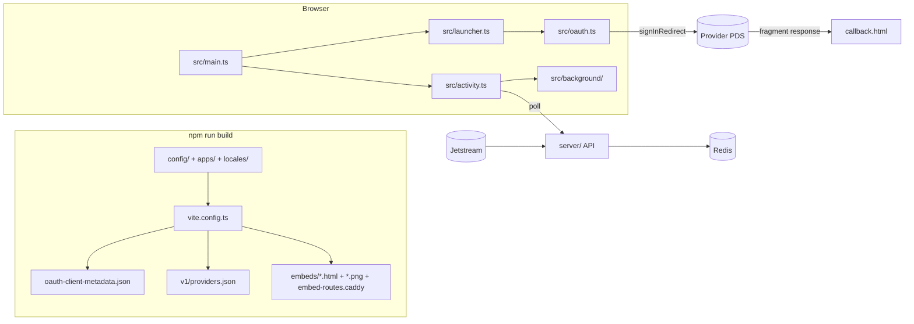

# AGENTS.md

Guide for coding agents and contributors working on launcher.at. Read this before you change anything. User-facing setup lives in [README.md](README.md) and [server/README.md](server/README.md).

## What this is

A static signup wizard for the Atmosphere (AT Protocol): an intro screen, then a provider picker, then the provider's own OAuth signup, then a completion screen that can send the user back to their app. An optional backend counts recent joins per provider and feeds a background "rocket launch" animation.

The site stores no accounts or tokens, and the frontend has no runtime server. Keep it that way.

## Repository layout

```
apps/<id>/config.json   Per-app branding; discovered automatically at build time
config/providers.json   Single source of truth for providers (frontend AND backend)
config/atmosphere-apps.json  App directory shown after a generic signup
locales/en.json         All UI strings (i18next keys)
index.html, callback.html  The two pages; callback.html is the OAuth redirect target
src/                    Browser code (vanilla TypeScript + SCSS, no framework)
build/                  Vite plugins: OAuth client metadata and link-preview images
vite.config.ts          Config validation, generated files, dev/preview middleware
Caddyfile               Production static server (Railpack); imports dist/embed-routes.caddy
server/                 Optional activity backend (separate npm package)
```

## Architecture



### Frontend (`src/`)

| File                     | Responsibility                                                                                                                                                                                                                                                                              |
| ------------------------ | ------------------------------------------------------------------------------------------------------------------------------------------------------------------------------------------------------------------------------------------------------------------------------------------- |
| `main.ts`                | Entry point. Renders the footer, starts the launch animation when enabled, and calls `launch()`.                                                                                                                                                                                            |
| `launcher.ts`            | All screens: `intro`, `selector` (provider picker with filter/sort), `complete`, `showError`, plus the OAuth callback. Each screen calls `screen()`, which clears the page, resets timers and moves focus to the heading. Picker state (sort, filters) survives navigating between screens. |
| `config.ts`              | Validates providers and app configs. Used by both the browser and the build. Any new config field is validated here.                                                                                                                                                                        |
| `apps.ts`                | Loads `apps/*/config.json` with `import.meta.glob`, looks apps up (`selectApp`), and applies the theme as CSS custom properties.                                                                                                                                                            |
| `oauth.ts` / `signup.ts` | Thin wrapper over `@atproto/oauth-client-browser`. `SignupOAuth` is the seam tests mock. `SignupError.key` is always a locale key.                                                                                                                                                          |
| `activity.ts`            | Backend client plus `startJoinFeed`: polling, pacing, de-duplication, idle/visibility pausing, and `Retry-After` backoff. It does no rendering.                                                                                                                                             |
| `background/`            | SVG rocket launches (`launches.ts`) along precomputed curves (`trajectory.ts`). It knows nothing about where its labels come from.                                                                                                                                                          |
| `carousel.ts`            | Auto-scrolling app directory, shown only after a generic (default-app) signup.                                                                                                                                                                                                              |
| `dom.ts`                 | `element(tag, text, className)` helper. Text is always set via `textContent`.                                                                                                                                                                                                               |
| `i18n.ts`                | Single i18next instance, English only.                                                                                                                                                                                                                                                      |

### Build (`build/`, `vite.config.ts`)

- **Validation.** `vite.config.ts` parses `config/providers.json` and every `apps/*/config.json` on start, so invalid config fails `npm run dev` and `npm run build`.
- **`build/metadata.ts`.** Generates the OAuth client metadata from `PUBLIC_ORIGIN`. A loopback origin uses the AT Protocol localhost client; any other origin must be public HTTPS with no port.
- **`build/embeds.ts`.** Writes Open Graph and Twitter tags into each page and renders a 1200×630 PNG per app with resvg, using the bundled Noto Sans fonts. It also emits Caddy rewrites so `/?app=<id>` serves `embeds/<id>.html` without changing the URL.
- **Build-time defines.** `__ACTIVITY_API__` is set from `PUBLIC_ACTIVITY_API`; an empty value disables all activity features.

### Backend (`server/`)

One Node process (Hono) with Redis. See [server/README.md](server/README.md) for the full contract.

| File                   | Responsibility                                                                                                          |
| ---------------------- | ----------------------------------------------------------------------------------------------------------------------- |
| `index.ts`             | Startup order (Redis, then routes, then HTTP, then the Jetstream consumer) and graceful shutdown in the reverse order.  |
| `env.ts`               | Environment parsing and limits. Every new variable goes here and into `.env.example`.                                   |
| `jetstream.ts`         | Consumes account events with a stall watchdog. The handler resolves the DID, matches the provider and records the join. |
| `identity.ts`          | Gets the PDS from the DID document. A handle is used only if it resolves back to the same DID.                          |
| `providers.ts`         | Parses `tracking.pdsHostMatchers` and matches PDS hostnames (exact or dot-suffix).                                      |
| `storage.ts`           | Redis keys and one atomic Lua write per event (count, recent entry and replay marker together).                         |
| `cursor.ts`            | Durable Jetstream cursor. Retries forever rather than lose a checkpoint.                                                |
| `protection.ts`        | Admission control before any route: per-client and global rate limits, method/URL/body checks, concurrency cap.         |
| `server.ts`, `routes/` | Hono app, CORS and the three GET endpoints.                                                                             |

## Invariants: do not break these

- **No HTML injection.** Never use `innerHTML` or insert markup. Use `element()` or `textContent`. App and provider names are untrusted text, including in `build/embeds.ts`, which escapes everything.
- **Redirects come from configuration only.** The return URL comes from the repository's `apps/<id>/config.json`. It never comes from query parameters or OAuth state; OAuth `state` carries only a validated app ID (`recoverAppId`). The default app can never redirect.
- **No identity leaks.** The launcher signs out its own OAuth session immediately and never shows or sends the DID. The backend never exposes DIDs and only publishes handles that verify both ways.
- **One provider list.** `config/providers.json` is read by the frontend, the build and the backend. Don't duplicate it.
- **The backend is single-consumer.** Never run two server instances against one Redis. When deploying, stop the old instance before starting the new one.
- **Failures must be honest.** API storage errors return 503, not empty or zero data. The frontend hides counts it couldn't load rather than inventing them.
- **Polling budget.** `POLL_MS` in `src/activity.ts` is sized against the server's default rate limits. If you change one, revisit the other.
- **Accessibility.** Keep visible focus, `aria-*` relationships, focus moving to the heading on each screen change, reduced-motion handling and 44–48px touch targets.

## Commands

Run these from the repository root unless noted. Requires Node 22.12+ for the frontend and 22.18+ for the server.

```sh
npm ci && npm --prefix server ci   # install both packages

npm run dev                        # http://127.0.0.1:5173 (use the IP, not localhost)
npm run lint                       # ESLint + Prettier check, frontend and server
npm run format                     # auto-fix lint, then Prettier
npm run typecheck                  # tsc -b (src/, build/, vite.config.ts)
npm test                           # frontend + build tests (Vitest)
npm run build                      # production build into dist/

npm --prefix server run typecheck
npm --prefix server test           # Redis and network are mocked; no services needed
npm --prefix server run dev        # needs Redis on 127.0.0.1:6379 and server/.env
```

## Before you finish a change

Run all of these. All must pass.

```sh
npm run lint && npm run typecheck && npm test && npm --prefix server run typecheck && npm --prefix server test
```

Then:

- **UI changes:** run `npm run build && npm run preview` and click through the changed flow. Try `/?app=example-app` and `/?app=example-app-dark` as well as the default app.
- **Build or preview changes:** inspect `dist/embeds/*.png`, `dist/oauth-client-metadata.json` and `dist/v1/providers.json`.
- **Server changes:** where possible, run against a real Redis (`docker run -p 6379:6379 -d redis:7-alpine`) and hit `/health` and both API endpoints.

## Testing practices

- **Frontend DOM tests** use `// @vitest-environment happy-dom` at the top of the file. Mock OAuth by passing a `SignupOAuth` object to `launch()`; never call real providers.
- **Timers:** polling, countdown and idle logic use `vi.useFakeTimers()`. Restore real timers in `afterEach`.
- **Server tests** use `ioredis-mock`, a fake `LiveTransport` and stubbed resolvers. Tests must stay deterministic and must not depend on the network.
- **What to test:** behaviour a user or consumer could notice, plus security boundaries. Examples are redirect safety, input validation, rate limits, replay idempotency, sorting and filtering edge cases, and failure states.
- **What not to test:** exact wording, CSS class names used only for styling, or values that merely echo a mock.
- **Bug fixes:** add a test that fails before the fix and passes after.

## Code style

- ESLint (`eslint.config.js`) and Prettier (`"prettier"` in `package.json`: no semicolons, single quotes, 120 columns) are enforced. Run `npm run format` rather than formatting by hand.
- Use type-only imports (`import type` or inline `type`); the linter enforces this.
- Keep it boring: plain functions and closures, no framework, no new runtime dependencies without a strong reason. The frontend ships three dependencies; keep it lean.
- Name your magic numbers (`REDIRECT_SECONDS`, `MAX_URL_LENGTH`, …). Comments explain _why_, not _what_.
- User-visible text goes in `locales/en.json`; reference it with `t('key')`. Error states carry locale keys, never raw library messages.
- Styles live in `src/styles/main.scss` and `src/background/*.scss`. Theme values come from the CSS custom properties set by `applyTheme`; don't hard-code theme colours.
- Line endings are LF (`.gitattributes`).

## Common tasks

- **Add an app:** create `apps/<id>/config.json`. The fields are documented in the README; the validator is `parseApps` in `src/config.ts`.
- **Add a provider:**
  1. Add the entry to `config/providers.json`.
  2. Add its description key to `locales/en.json`.
  3. Optionally add a logo under `public/providers/`.
  4. To have the backend track it, add a `tracking` block with verified PDS host matchers.
- **Add a config field:** validate it in `src/config.ts` (or `server/src/providers.ts`), add a test for rejected values, and document it in the README table.
- **Add an environment variable:** frontend variables must be prefixed `PUBLIC_` and read in `vite.config.ts`. Backend variables go in `server/src/env.ts` and `server/.env.example`. Document both in the relevant README.

## Deployment (Railway)

Project `launcher-at`, environment `production`, with services `website`, `server` and `Redis`.

```sh
# Website: build with Railpack, served by Caddy from dist/
railway up --service website --environment production --ci

# Server: ALWAYS stop first, so two Jetstream consumers never overlap
railway down --service server --environment production --yes
# wait until `railway status` shows server Offline
railway up --service server --environment production --ci
curl --fail https://server-production-1e48d.up.railway.app/health
```

Changing the website origin means rebuilding with the new `PUBLIC_ORIGIN` and updating the server's `ALLOWED_ORIGINS`.
